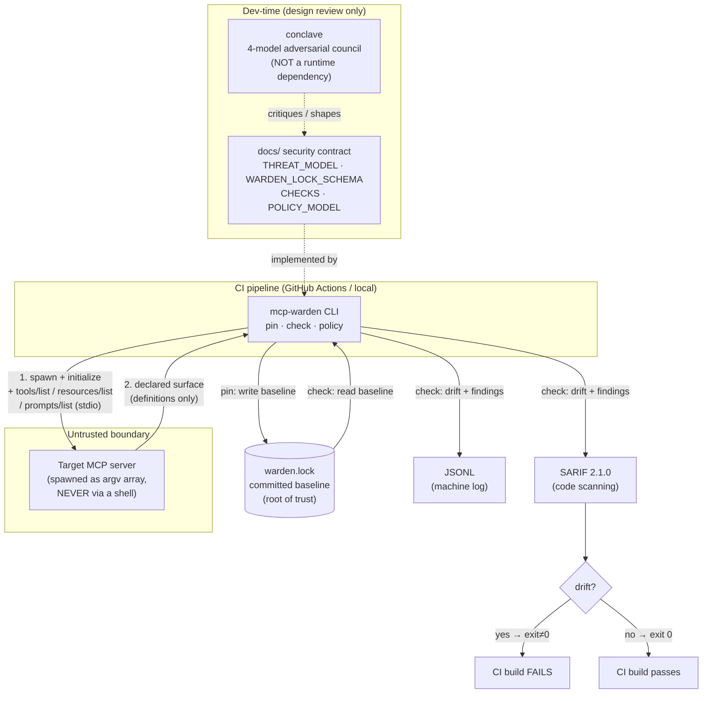
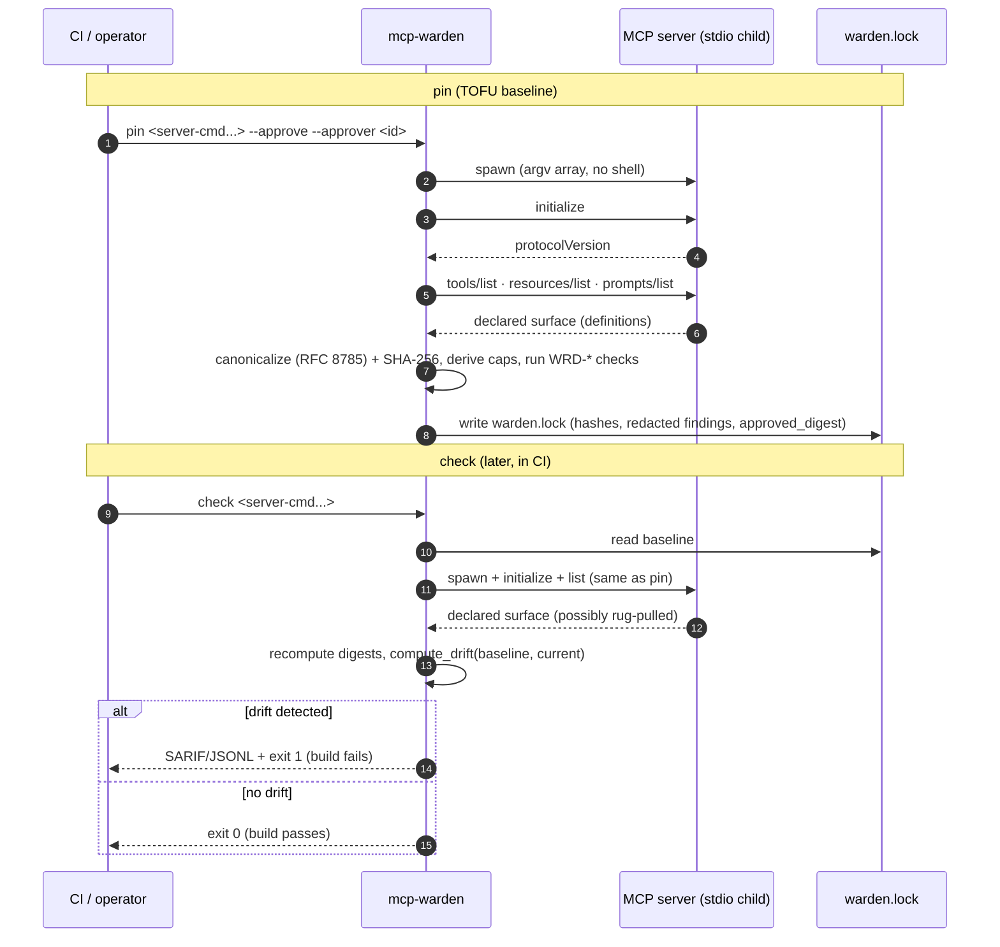

# mcp-warden — System Context Diagram

Where mcp-warden sits, what it talks to, and where its outputs go. mcp-warden is
a **read-only, definition-only** gate: it spawns the target MCP server over
stdio, captures the *declared* surface, and writes a baseline + machine reports.
There is no proxy and no runtime interception in v0.1.

> `conclave` (the 4-model adversarial council referenced in `docs/THREAT_MODEL.md`)
> is a **dev-time design reviewer** that shaped this contract. It is **NOT** a
> runtime dependency and is never invoked by `pin`/`check`/`policy`.

---

## C1 — System context

---

## C2 — `pin` then `check` sequence

---

## Trust boundary (from `docs/THREAT_MODEL.md` §3.3)

- **Trusted:** mcp-warden, the Python runtime it runs in, and `warden.lock` in
  the repo (delegated to host controls — PR review, branch protection).
- **Untrusted:** everything on the server side of the stdio pipe.
- The boundary is the **stdio channel** between mcp-warden and the spawned server.

## What is explicitly NOT in this picture (v0.1)

- No runtime proxy / no agent-in-the-loop (`policy` is design-time only).
- No tool-result inspection (the headline v0.2 gap, `T-RESULT`).
- No network calls by the checks; no DNS resolution at policy time.
- stdio transport only (HTTP/SSE deferred).
