# Agent Trust Kernel — Normative Security Contract

**Status:** Design contract (DSE-714). DSE-715 implements the isolated content-envelope
foundation; whole-kernel conformance remains pending DSE-716 and DSE-717.
**Scope:** Deterministic reference monitor beneath agents and protocol adapters.
**Document owner:** Security. Changes require threat-model review.

> **Current-product boundary:** MCP-Warden v1.1 does **not** claim conformance with this
> contract. Its shipped `guard` runtime intentionally has opt-outs and fail-open paths, and
> it does not yet provide universal provenance, complete mediation, bounded authority, or
> evidence-before-effect. Those differences remain honest product limits until downstream
> implementation and conformance work closes them.

The key words **MUST**, **MUST NOT**, **REQUIRED**, **SHOULD**, and **MAY** are normative.

---

## 1. Purpose and security claim

The Agent Trust Kernel (ATK) is a deterministic, client-agnostic reference monitor. It
decides whether an agent-related capability may execute, enforces that decision before the
effect, and emits tamper-evident evidence. Its security claim is deliberately narrow:

- all external content and software enter untrusted;
- only verified deterministic policy may grant bounded authority;
- every security-relevant operation is mediated immediately before execution or release;
- uncertainty denies or quarantines instead of silently allowing; and
- AI may advise, but can never become an authority source.

This contract defines the non-bypassable rules. It does not define a user interface, hosted
control plane, protocol-specific adapter, or semantic AI classifier.

## 2. Trust model

### 2.1 Trusted computing base

This list is exhaustive: the trusted computing base (TCB) comprises only:

- the host operating-system and hardware mechanisms that enforce process isolation, protected
  storage, key protection, trusted time, and monotonic counters;
- the kernel runtime and its protected process boundary;
- the policy decision point (PDP) and policy enforcement point (PEP);
- canonicalization, hashing, signature verification, and approved cryptographic libraries;
- explicitly configured trust roots, protected signing keys, and verified policy/rule bundles;
- TCB-owned trusted time: a monotonic, non-rollback source plus an authenticated epoch/freshness
  source, together with protected sequence and revocation state used by a decision;
- the append-only decision-receipt log plus the independent fallback evidence log and its
  protected monotonic counter; and
- an evidence-store-independent fail-closed recovery latch (poison state).

Compromise of the TCB, trust-root keys, or an authorized policy administrator is a residual
boundary, not a defended threat.

Trusted time MUST be bound to the TCB's identity and protected configuration so it cannot be
substituted or influenced without TCB compromise. A new monotonic reading below the
TCB-protected last-accepted reading is rollback. An authenticated epoch/freshness reading that
disagrees with the monotonic-derived epoch beyond a signed or configured tolerance is
inconsistent. Either condition MUST deny every decision that consumes freshness, validity,
expiry, revocation, generation ordering, or any temporally bounded authority input, as MUST an
unavailable epoch/freshness source. Caller-, source-, transport-, and model-supplied timestamps
are untrusted evidence: they MUST NOT establish or repair authoritative time, freshness, lease
validity, ordering, or expiry.

TCB-protected monotonic counters, highest-accepted generation floors, and the recovery latch
MUST survive process and host restart and MUST resist rollback through VM, container, disk, or
filesystem snapshots. Conforming implementations MUST anchor that state in a TPM, HSM, or an
equivalent rollback-resistant protected store outside the rollback domain being defended. A
platform that cannot provide this property is nonconformant and MUST remain fail closed.

Adapters are explicitly outside the TCB. They are untrusted, verified-external components that
MUST remain enclosed by the TCB-owned PEP for every operation. A conformance report, test pass,
or signed adapter claim is evidence, not authority; the runtime MUST verify the adapter and its
signed manifest and enforce the PEP on each operation rather than trust a prior pass result.

### 2.2 Protected assets

| Asset | Required protection |
|---|---|
| Authority state | Policy, rules, trust roots, leases, revocations, critical-class floor, and governance history retain integrity, freshness, and rollback resistance |
| Identity and context | Subject, agent, device, session, adapter, source, publisher, purpose, and policy-administrator claims are authenticated and bound to the decision |
| Protected data and secrets | Reads, transformations, disclosures, and communications are mediated; outputs and evidence reveal only the minimum authorized content |
| Executable supply chain | Kernel, adapters, bundles, dependencies, and canonicalizers load only at verified identities and versions |
| Decision evidence | Canonical decision inputs, verdicts, receipts, and transparency-log ordering remain attributable, tamper-evident, and replay-resistant |
| Availability | Fail-closed behavior preserves safety under component or network failure, while recovery exposes no normal protected capability |

### 2.3 Authoritative identities and roles

An identity claim is data until authenticated by configured deterministic trust material. The
kernel MUST distinguish and bind these principals rather than infer or collapse them:

| Identity or role | Permitted authority |
|---|---|
| User/subject | Requests only capabilities explicitly granted to that authenticated subject |
| Agent | Acts only within the subject's bounded delegation; cannot delegate through content |
| Device and session | Supply authenticated execution context, freshness, and anti-replay binding |
| Adapter | Translates a named protocol at a verified version; has no independent authority |
| Content source | Supplies provenance claims and data, never policy or authority |
| Bundle publisher/signer | Attests a specific digest and identity; does not by itself authorize execution |
| Policy administrator | Publishes signed policy within an assigned governance scope; cannot weaken the kernel's critical floor at runtime |
| Recovery administrator | Authorizes recovery repairs and exit after fresh integrity verification; cannot publish policy unless that separate role is also assigned |
| Trust-root or receipt signer | Authenticates the artifact type and key scope assigned to it; signatures are not interchangeable across roles |

### 2.4 Untrusted inputs and actors

The kernel MUST treat these as untrusted until verified by deterministic rules:

- agents and model output;
- protocol adapters, their manifests, and their conformance outputs;
- MCP servers, tools, prompts, resources, results, and source-provided identity claims;
- software bundles, packages, repositories, metadata, manifests, and dependencies;
- web content, documents, email, database text, plugin metadata, and agent messages;
- transport payloads and storage outside the protected receipt/key boundary; and
- human-authored content that is not a signed governance artifact from an authorized role.

An attacker may craft malformed, oversized, nested, ambiguous, or adversarial inputs; inject
instructions; lie in metadata; replay, reorder, delay, or drop messages; exploit
canonicalization confusion; fingerprint clients; induce network or offline failure; and seek
direct adapter/tool bypasses. The model does not assume an attacker can break approved
cryptography without compromising the TCB.

### 2.5 Named threat classes

| Threat | Mandatory control | Residual boundary |
|---|---|---|
| Confused deputy or context substitution | ATK-04, ATK-07, and ATK-09 bind the exact subject, agent, session, purpose, arguments, and operation at the PEP | A correctly authorized capability may still be misused within its bound scope |
| Authority laundering through content, transforms, or agents | ATK-01, ATK-02, ATK-05, and ATK-07 prevent content or lineage from acquiring transferable authority | Deterministic rules may miss malicious semantics that do not alter authority inputs |
| Malicious or substituted bundle | ATK-03 and ATK-11 verify identity, dependency closure, policy binding, freshness, and rollback state before load | Compromised trusted publisher or trust-root keys remain outside the defended boundary |
| Mediation bypass, adapter drift, or adapter TOCTOU | ATK-04 requires structurally enforced mediation and conformance gates disable any unmediated, racy, or nonconformant path | Only TCB compromise remains residual; a structurally unenforceable boundary is nonconformant, not an accepted risk |
| Replay, rollback, or stale authorization | ATK-09 and ATK-11 make generation, sequence, freshness, and expiry explicit and fail closed | Offline revocation lag is accepted only inside the configured freshness window |
| Receipt or evidence tamper | ATK-10 through ATK-12 require canonical signed receipts, ordering, redaction, and tamper detection | Evidence-log deletion can deny service; it cannot authorize an effect |

## 3. Normative invariants

### ATK-01 — Untrusted by default

Every software bundle and external content item MUST enter with an explicit untrusted state.
Absence of provenance, a familiar publisher name, prior exposure, or model confidence MUST
NOT create trust or authority.

### ATK-02 — Monotonic provenance and taint

Every transformation MUST create a canonical content envelope containing the content hash,
source claims, parent hashes, transform identity and version, and taint state. A transform MAY
remove a named taint dimension only when an independently signed governance rule binds the
exact transform identity and version, the affected taint dimension, and the required evidence.
Envelope provenance fields and source claims are descriptive or corroborating evidence only;
they MUST NOT authorize taint removal by themselves. Content meaning, model output, and semantic
classification are never sufficient positive evidence for taint removal or authority, including
when referenced by a signed governance rule. Sanitization MUST NOT confer authority, erase
lineage, turn data into policy, or remove, downgrade, or override any mandatory critical class
or critical-floor outcome.

### ATK-03 — Verified execution identity

No executable bundle or adapter MAY load until its digest, signature, version, dependency
identity, and policy binding verify against configured trust roots. Source-provided metadata
is evidence to verify, never authority. Material drift MUST require reapproval.

### ATK-04 — Complete mediation

Every security-relevant operation—including a read, disclosure, transformation,
communication, or external effect—MUST pass through the PEP immediately before execution or
release. The PEP MUST consume the PDP decision bound to the exact subject, context,
operation, capability, arguments, protected data, destination, and policy generation. A
direct adapter, tool, storage, or protocol path around the PEP is nonconformant and MUST be
disabled. Mediation MUST be structurally enforced so a conforming adapter has no alternate
operation-to-sink path. An adapter TOCTOU window or host boundary that cannot enforce this
ordering is a conformance failure, not an accepted residual risk. Dynamic, reflected, or plugin
handler registration MUST match the signed authoritative operation manifest before the handler
is enabled; a missing or mismatched registration MUST be rejected and the adapter disabled.

### ATK-05 — Deterministic authority

Only signed, versioned, deterministic rules and governance artifacts may affect authority.
Model output and semantic classifiers MAY contribute untrusted evidence that signed
deterministic policy consumes for advisory or more-restrictive outcomes. They MUST NOT
directly modify policy, trust state, a decision, an override, or a receipt, and MUST NOT grant,
expand, restore, or override authority. No governance rule may treat content or model semantics
as sufficient positive evidence to grant authority or remove taint.

### ATK-06 — Default deny under uncertainty

Missing, malformed, unknown, unsupported, expired, revoked, ambiguous, timed-out, rolled-back,
or internally errored authority inputs MUST produce deny or quarantine. They MUST NOT produce
implicit allow, shadow-only enforcement, automatic downgrade, or a permissive fallback. A
candidate policy or rule MUST be validated in isolated staging before activation. A malformed,
invalid, stale, or unauthorized candidate MUST be rejected without changing a fresh known-good
active policy and MUST NOT by itself trigger recovery-only mode. Failure of active policy or
engine integrity, or absence of any valid current policy, MUST deny and enter recovery-only mode.

### ATK-07 — Least and bounded privilege

An allow or limit decision MUST bind the subject, agent, device, session, data scope,
capability, normalized arguments, purpose, policy/rule versions, and a finite lease. Any
binding mismatch, expiry, or revocation MUST deny. Authority MUST NOT be transferable through
content or agent messages.

### ATK-08 — Non-overridable criticality

A critical deterministic finding MUST NOT become allow through agent advice, a human
per-decision override, adapter flags, `--audit-only`, or category opt-outs. Runtime governance
MAY add or strengthen critical classes, but MUST NOT remove, downgrade, or exempt the kernel's
mandatory critical floor. Changing that floor requires a reviewed security-contract and
kernel-version change; an ordinary signed governance action cannot change it or override an
affected decision.

### ATK-09 — Canonical and explicit decision input

All facts that can change a decision—including time, freshness, sequence, policy/rule
versions, trust material, revocation state, and normalized arguments—MUST be explicit
canonical inputs. Hidden environment state is forbidden. Identical inputs MUST yield
byte-identical unsigned canonical decision payloads and stable reason codes. Signature and
certificate bytes are outside this determinism claim, but every signature MUST verify against
the exact fixed unsigned payload and an authorized signer identity. Authoritative time MUST
come only from the TCB-owned trusted-time sources in §2.1; caller timestamps remain untrusted
evidence. Missing, inconsistent, or rolled-back trusted time MUST deny every decision that
consumes freshness, validity, expiry, revocation, generation ordering, or any temporally bounded
authority input.

### ATK-10 — Evidence before effect

The kernel MUST produce an unsigned canonical receipt payload for every allow, limit, deny,
quarantine, override, revoke, and expiry decision, then sign that exact payload with an
authorized receipt-signer identity. Signature or certificate bytes MAY vary; the unsigned
canonical payload MUST NOT. Before the PEP invokes an allowed or limited operation, or an
operation permitted by a non-critical override, that receipt MUST be durably appended; signing
or append failure MUST convert the outcome to deny. Deny, quarantine, revoke, and expiry MUST
still enforce if their primary receipt attempt fails; logging failure MUST NEVER turn a negative
decision into allow. The kernel MUST then enter evidence-degraded recovery-only mode and attempt
an independent durable append-only fallback event bound to a TCB-protected monotonic counter and
a stable failure reason code. If both primary and fallback evidence persistence fail, the kernel
MUST set the TCB-protected, evidence-store-independent fail-closed recovery latch before emitting
only a minimal secret-safe local signal. If the latch cannot be set or read, the implementation
MUST remain fail closed and is nonconformant.

The recovery latch MUST survive every restart and snapshot restore; process or host restart MUST
NOT clear it. Startup MUST NOT enter normal operation unless the primary and fallback evidence
paths are healthy, the latch is readable and clear, and any previously latched recovery has
completed an explicit authenticated recovery exit. Every permitted non-critical override MUST
identify its authorized actor, scope, reason, and finite expiry in the decision and receipt.

### ATK-11 — Anti-replay and anti-rollback

Policies, rules, leases, bundles, revocation snapshots, receipts, and logs MUST bind generation,
sequence, freshness, and expiry as applicable. Stale, replayed, truncated, reordered, or
rolled-back authority MUST fail closed. For each artifact class, the TCB MUST durably retain the
highest accepted generation and its identity digest. A cached artifact is eligible offline only
while its signed validity/freshness bounds hold and its generation is greater than or equal to
that protected floor; an equal generation MUST match the protected digest. A generation below
the floor is rollback and MUST deny. The possible existence or temporary unavailability of an
unknown newer generation is not rollback and does not invalidate an otherwise eligible cached
artifact. If the protected floor is unavailable or inconsistent, the kernel MUST deny rather
than infer history.

### ATK-12 — Secret-safe outputs

Errors, receipts, logs, metrics, and agent-facing explanations MUST expose stable reason codes
and the minimum redacted evidence required for review. They MUST NOT emit raw secrets,
protected content, untrusted exception text, or hidden policy detail that creates a practical
evasion oracle. Agent-facing reasons MUST come from a coarse, reviewed reason-code allowlist and
MUST NOT reveal internal rule identifiers, match thresholds, scoring details, or other tuning
information that enables iterative evasion.

## 4. Non-overridable critical classes

The baseline critical set MUST include:

- integrity, signature, trust-root, or canonicalization failure;
- policy, rule, lease, receipt, log, sequence, replay, or rollback tamper;
- invalid, expired, or revoked identity or authority;
- provenance laundering or an untrusted attempt to modify authority or policy;
- PDP, PEP, or adapter bypass, conformance failure, or internal decision uncertainty;
- credential or secret exfiltration;
- deterministic private-network SSRF or exfiltration; and
- unapproved executable, dependency, bundle, or capability drift.

Fuzzy prompt-injection findings are not automatically critical authority signals. They MAY
quarantine content under a signed deterministic policy, but a model's confidence score alone
cannot place or remove an item in the critical set.
This baseline is the kernel's mandatory critical floor. Runtime policy may extend it or make
its outcomes stricter, but cannot remove, downgrade, exempt, or reclassify any listed class.
Any baseline taxonomy reclassification requires review of this security contract and a kernel
version change; an ordinary governance update is insufficient.

## 5. Fail-closed decision matrix

**Quarantine** confers no authority: quarantined content or software MUST remain isolated.
Inspection is limited to mediated hash/digest verification, signature verification, schema
validation, and canonicalization checks. Quarantine MUST NOT render, execute, import, or make
network requests; disclose protected data; alter policy; or approve the quarantined item.

Candidate policies and rules MUST be validated in isolated staging. A malformed, invalid,
unauthorized, or stale candidate is rejected while the fresh known-good active policy continues;
candidate rejection alone MUST NOT enter recovery-only mode.

**Recovery-only mode** is entered automatically and fail closed only when active policy or
engine integrity fails, no valid current policy exists, a verified internal integrity error
occurs, or an evidence-path failure requires it. Entry MUST NOT depend on prior administrator
authentication or a successful signature operation, because denial and containment cannot wait
for either. Entry confers no authority, MUST deny every normal request, and MUST create critical
evidence through the primary receipt path or the independent fallback where available. During
recovery, only authenticated integrity diagnostics and repair using verified artifacts are
permitted. A Recovery Administrator MAY repair only with a pre-approved recovery artifact whose
exact identity and digest verify against protected recovery authority. That role MUST NOT author,
modify, or substitute policy during recovery. Exit requires BOTH an authenticated Recovery
Administrator action AND successful integrity verification against fresh trusted artifacts. The
Recovery Administrator gains no policy-publishing authority unless separately assigned that
role outside recovery. Normal requests remain denied until both exit conditions hold; diagnostic
output MUST be minimal and redacted.

| Condition | Required result |
|---|---|
| Missing/malformed provenance or unknown schema/version | Quarantine content; deny authority and effects |
| Bundle digest/signature/identity mismatch | Quarantine bundle; never load |
| Malformed, invalid, stale, or unauthorized candidate policy/rule | Reject in isolated staging; keep the fresh known-good active policy; do not enter recovery |
| Active policy/rule/engine integrity failure, no valid current policy, or verified internal integrity error | Deny; automatically enter recovery-only mode and attempt critical evidence |
| Missing/expired/revoked subject, purpose, capability, or lease | Deny |
| Taint loss or untrusted attempt to alter authority/policy | Deny; emit critical finding |
| Critical deterministic rule match | Deny or quarantine; no override |
| Uninspectable or over-cap effect-bearing input | Deny or quarantine; never pass through |
| Adapter correlation/conformance failure | Disable adapter; deny |
| Allow/limit/override receipt signing or append failure | Convert to deny; do not invoke operation; attempt the deny receipt path |
| Deny/quarantine/revoke/expiry primary receipt failure | Enforce the result; enter evidence-degraded recovery-only mode; append an independent monotonic fallback event |
| Independent fallback append failure after primary evidence failure | Set the independent recovery latch; remain fail closed; emit a minimal safe local signal; never resume normal requests until explicit authenticated recovery |
| Recovery latch unavailable, unreadable, unsettable, or rolled back | Remain fail closed; platform is nonconformant |
| Valid cached offline artifact at/above the TCB-protected generation floor | Decide normally within signed validity/freshness bounds; equal generation must match the protected digest |
| Artifact generation below the durable highest accepted generation | Deny as rollback |
| Unknown newer generation unavailable | Continue with an otherwise eligible cached artifact; absence of knowledge is not rollback |
| Missing/stale trust root, trusted time, revocation state, or policy offline | Deny; never trust caller time, fetch implicitly, or downgrade |

## 6. Offline operation

The decision path MUST perform no network I/O. Operators MUST pre-provision signed policy and
rule bundles, trust roots, protected keys, revocation snapshots, freshness bounds, and the
authenticated epoch/freshness state through a separate authenticated synchronization operation.
That synchronization is outside evaluation; evaluation MUST NOT fetch time or authority state.
Cached material MAY be used only while its explicit validity and freshness requirements hold and
its generation is not below the TCB-protected highest generation previously accepted. An equal
generation MUST match the protected identity digest. Unavailability of an unknown newer
generation does not by itself invalidate eligible cached material; a generation below the
durable floor is rollback and MUST deny.

Authenticated synchronization is a separate operation from evaluation. Missing trust
material, unavailable or untrustworthy TCB-owned time, an expired snapshot, or a stale policy
MUST deny. Caller timestamps cannot cure that failure. An offline
node cannot learn about revocations newer than its permitted freshness window; that lag is an
accepted, bounded residual risk.

## 7. Reference decision flow

```mermaid
flowchart LR
    ingress["Untrusted content or capability request"]
    envelope["Canonical envelope\nprovenance + taint"]
    pdp["Deterministic PDP\npolicy + explicit context"]
    verdict{"decision"}
    receipt["Sign + append permit receipt"]
    blockedReceipt["Attempt non-permit receipt"]
    evidenceDegraded["Evidence-degraded\nrecovery-only mode"]
    fallback["Independent durable fallback\nmonotonic counter"]
    latch["TCB-protected fail-closed\nrecovery latch"]
    safeSignal["Minimal secret-safe\nlocal signal"]
    pep["PEP immediately before effect"]
    effect["Capability effect"]
    blocked["Deny or quarantine\nsecret-safe reason"]

    ingress --> envelope --> pdp --> verdict
    verdict -- "deny / quarantine / revoke / expiry" --> blockedReceipt
    blockedReceipt -- durable --> blocked
    blockedReceipt -- "primary receipt failure: still enforce" --> evidenceDegraded
    evidenceDegraded --> fallback
    fallback -- durable --> blocked
    fallback -- failure --> latch --> safeSignal --> blocked
    verdict -- "allow / limit / non-critical override" --> receipt
    receipt -- "failure: convert to deny" --> blockedReceipt
    receipt -- durable --> pep --> effect
```

No adapter may connect `ingress`, `envelope`, or `pdp` directly to `effect`.

## 8. Explicit cuts

The kernel deliberately does not provide:

- LLM or semantic adjudication as enforcement authority;
- a guarantee that an authorized tool behaves safely within its granted capability;
- protection after host, TCB, trust-root, signing-key, or authorized-admin compromise;
- perfect secret, prompt-injection, or encrypted-content detection;
- network-dependent or automatic trust-root refresh in the decision path;
- post-effect remediation as a substitute for pre-effect mediation; or
- a claim that provenance proves source claims are true—provenance proves recorded lineage.

## 9. Residual risks

Accepted residual risks include trusted-administrator abuse, TCB/key compromise, misuse within
an allowed capability, offline revocation lag, deterministic-rule false negatives,
availability loss caused by fail-closed behavior, and false source claims preserved faithfully
by provenance. Invalid candidate artifacts alone cannot deny service while a fresh known-good
active policy remains valid. Attacker-induced denial of service is an accepted residual only
when active authority or evidence state is corrupted or exhausted, forcing fail-closed entry
into recovery-only mode and authenticated administrator recovery. Adapter TOCTOU and structurally
unenforceable mediation are conformance failures and are not accepted residual risks.

## 10. Downstream implementation bindings

Every invariant has exactly one primary implementation owner. Secondary bindings identify the
components that must consume or enforce the primary owner's contract.

| Invariant | Primary owner | Secondary bindings | Required deliverable |
|---|---|---|---|
| ATK-01 | DSE-715 | DSE-716 | Explicit untrusted ingress state; PDP/PEP rejects missing state |
| ATK-02 | DSE-715 | DSE-716, DSE-717 | Canonical lineage and taint propagation; independently signed transform authority; receipt lineage |
| ATK-03 | DSE-716 | DSE-715, DSE-717 | Bundle identity fields from 715; structurally enforced load gate; receipt binding |
| ATK-04 | DSE-716 | DSE-717 | Structurally complete mediation and instrumented operation-to-sink proof; evidence sink integration |
| ATK-05 | DSE-716 | DSE-715, DSE-717 | Deterministic authority inputs; AI evidence cannot grant/expand authority; signed rule binding |
| ATK-06 | DSE-716 | DSE-715, DSE-717 | Fail-closed decision/error matrix across envelope, PDP/PEP, and evidence paths |
| ATK-07 | DSE-716 | DSE-715, DSE-717 | Bounded subject/context/operation/lease binding preserved in envelopes and receipts |
| ATK-08 | DSE-716 | DSE-717 | Non-overridable enforcement of the mandatory critical floor; rule schema may only strengthen it |
| ATK-09 | DSE-716 | DSE-715, DSE-717 | Canonical inputs plus TCB-owned trusted time, sequence, freshness, and stable reasons |
| ATK-10 | DSE-717 | DSE-716 | Evidence-before-effect, independent negative-decision fallback, and persistent recovery latch integrated with the PEP |
| ATK-11 | DSE-717 | DSE-715, DSE-716 | Receipt/log anti-replay and anti-rollback bound to envelope and decision generations in rollback-resistant state |
| ATK-12 | DSE-717 | DSE-715, DSE-716 | Secret-safe envelopes, decisions, receipts, fallback events, metrics, and explanations |

The implementation dependency order is **DSE-715 → DSE-716 → DSE-717**: 715 defines the
envelope consumed by 716; 716 establishes the structural PEP boundary used by 717's
evidence-before-effect path. DSE-717 MUST NOT be considered complete until DSE-716's ATK-04
mediation conformance gates pass. No downstream ticket may weaken an invariant silently. A
proposed exception requires a security-contract change and review before implementation.

### DSE-715 implementation status

`ContentEnvelopeV1` now implements and tests the DSE-715 portions of ATK-01, ATK-02, ATK-05,
ATK-06, ATK-09, and ATK-12: literal untrusted ingress, immutable deterministic lineage,
monotonic registered taint, strict bounded canonical parsing, domain-separated digests, no
authority-bearing field/API, and digest-only secret-safe public output. Its lineage verifier is
intentionally bounded and one-hop. It does not verify source truth, artifact authenticity,
transitive ancestry, policy, authorization, mediation, or evidence-before-effect.

This partial implementation does not change the current-product boundary: no shipped runtime
may claim ATK conformance until DSE-716/717 integrate the envelope through the complete
mediation and durable evidence paths and every conformance gate below passes.

## 11. Conformance gates

A component or adapter may claim ATK conformance only through a mechanically executable suite.
Each adapter MUST publish a finite manifest enumerating every security-relevant operation and
its authorized sink. That manifest MUST be the runtime's authoritative operation allowlist:
unlisted operations are rejected, and the harness MUST prove a bijection between manifest
entries and registered handlers/sinks, including handlers registered dynamically, through
reflection, or by plugins. The suite MUST instrument both registration and execution, drive the
manifest through an instrumented PEP/sink harness, use a fixed versioned malformed-input corpus,
plant a unique secret through every untrusted input channel named in §2.4, and byte-scan every
serialized output channel. Automated evidence MUST prove:

1. Golden vectors produce byte-identical unsigned canonical decision payloads and unsigned
   canonical receipt payloads from identical explicit inputs. Randomized signature or
   certificate bytes MAY differ, but each signature verifies against the exact fixed payload and
   an authorized identity.
2. Every operation in the finite adapter manifest reaches its sink only after the instrumented
   PEP records the exact bound decision; missing, extra, or alternate sink paths fail the suite.
3. Every case in the fixed malformed corpus—including unknown, expired, revoked, replayed,
   oversized, ambiguous, and untrustworthy-time inputs—cannot
   produce an unauthorized read, disclosure, transformation, communication, or external
   effect.
4. A protected monotonic backward step denies; unavailable epoch/freshness time denies every
   decision that consumes freshness, validity, expiry, revocation, generation ordering, or any
   temporally bounded authority input; and a caller timestamp contradicting trusted time is
   ignored and cannot change the verdict.
5. Candidate-policy tests reject malformed/invalid candidates without disturbing a fresh
   known-good active policy, while active-policy/engine integrity failure or no valid current
   policy enters recovery-only mode.
6. Every critical class resists agent, human, adapter, audit-only, and opt-out override attempts.
   A model-confidence input MUST NOT relax a deterministic deny into allow.
7. Transformations cannot silently drop taint, erase lineage, gain authority, use source
   provenance as taint-removal authorization, or remove/override the mandatory critical floor.
8. Evaluation performs no network I/O; a valid cached artifact at or above the protected
   generation floor works, an artifact below it denies as rollback, and unavailability of an
   unknown newer generation does not create a false rollback.
9. Policy, receipt, fallback event, and log tamper/truncate/reorder/replay/rollback cases fail
   closed. Total primary-plus-fallback evidence failure sets the independent recovery latch;
   failure to set or read it remains fail closed and fails conformance. Restart does not clear a
   set latch, and normal startup requires healthy evidence paths, a readable cleared latch, and
   explicit authenticated recovery exit after any latched failure.
10. Process and host restart plus VM, container, disk, and filesystem snapshot-rollback tests
    cannot reduce a protected monotonic counter or generation floor or clear a recovery latch.
    The suite MUST exercise the selected TPM, HSM, or equivalent rollback-resistant store; a
    platform that cannot preserve these properties fails conformance.
11. A byte-for-byte scan confirms the distinct secret planted through each §2.4 input channel
    never appears in any serialized decision, error, receipt, fallback event, log, metric, or
    agent-facing explanation.

Until those gates exist and pass, documentation MUST use **design contract** or
**implementation pending**, never **ATK-conformant**.
