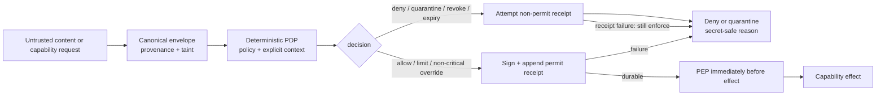

# Agent Trust Kernel — Normative Security Contract

**Status:** Design contract (DSE-714). Implementation conformance is pending DSE-715,
DSE-716, and DSE-717.
**Scope:** Deterministic reference monitor beneath agents and protocol adapters.
**Document owner:** Security. Changes require threat-model review.

> **Current-product boundary:** MCP-Warden v1.1 does **not** claim conformance with this
> contract. Its shipped `guard` runtime intentionally has opt-outs and fail-open paths, and
> it does not yet provide universal provenance, complete mediation, bounded authority, or
> evidence-before-effect. Those differences remain honest product limits until downstream
> implementation and conformance work closes them.

The key words **MUST**, **MUST NOT**, **REQUIRED**, **SHOULD**, and **MAY** are normative.

---

## 1. Purpose and security claim

The Agent Trust Kernel (ATK) is a deterministic, client-agnostic reference monitor. It
decides whether an agent-related capability may execute, enforces that decision before the
effect, and emits tamper-evident evidence. Its security claim is deliberately narrow:

- all external content and software enter untrusted;
- only verified deterministic policy may grant bounded authority;
- every security-relevant operation is mediated immediately before execution or release;
- uncertainty denies or quarantines instead of silently allowing; and
- AI may advise, but can never become an authority source.

This contract defines the non-bypassable rules. It does not define a user interface, hosted
control plane, protocol-specific adapter, or semantic AI classifier.

## 2. Trust model

### 2.1 Trusted computing base

The trusted computing base (TCB) is limited to:

- the kernel runtime and its protected process boundary;
- the policy decision point (PDP) and policy enforcement point (PEP);
- canonicalization, hashing, signature verification, and approved cryptographic libraries;
- explicitly configured trust roots, protected signing keys, and verified policy/rule bundles;
- explicit clock, sequence, freshness, and revocation state used by a decision;
- the append-only decision-receipt log; and
- adapters that pass the ATK conformance suite and cannot bypass the PEP.

Compromise of the TCB, trust-root keys, or an authorized policy administrator is a residual
boundary, not a defended threat.

### 2.2 Protected assets

| Asset | Required protection |
|---|---|
| Authority state | Policy, rules, trust roots, leases, revocations, critical-class floor, and governance history retain integrity, freshness, and rollback resistance |
| Identity and context | Subject, agent, device, session, adapter, source, publisher, purpose, and policy-administrator claims are authenticated and bound to the decision |
| Protected data and secrets | Reads, transformations, disclosures, and communications are mediated; outputs and evidence reveal only the minimum authorized content |
| Executable supply chain | Kernel, adapters, bundles, dependencies, and canonicalizers load only at verified identities and versions |
| Decision evidence | Canonical decision inputs, verdicts, receipts, and transparency-log ordering remain attributable, tamper-evident, and replay-resistant |
| Availability | Fail-closed behavior preserves safety under component or network failure, while recovery exposes no normal protected capability |

### 2.3 Authoritative identities and roles

An identity claim is data until authenticated by configured deterministic trust material. The
kernel MUST distinguish and bind these principals rather than infer or collapse them:

| Identity or role | Permitted authority |
|---|---|
| User/subject | Requests only capabilities explicitly granted to that authenticated subject |
| Agent | Acts only within the subject's bounded delegation; cannot delegate through content |
| Device and session | Supply authenticated execution context, freshness, and anti-replay binding |
| Adapter | Translates a named protocol at a verified version; has no independent authority |
| Content source | Supplies provenance claims and data, never policy or authority |
| Bundle publisher/signer | Attests a specific digest and identity; does not by itself authorize execution |
| Policy administrator | Publishes signed policy within an assigned governance scope; cannot weaken the kernel's critical floor at runtime |
| Trust-root or receipt signer | Authenticates the artifact type and key scope assigned to it; signatures are not interchangeable across roles |

### 2.4 Untrusted inputs and actors

The kernel MUST treat these as untrusted until verified by deterministic rules:

- agents and model output;
- MCP servers, tools, prompts, resources, results, and source-provided identity claims;
- software bundles, packages, repositories, metadata, manifests, and dependencies;
- web content, documents, email, database text, plugin metadata, and agent messages;
- transport payloads and storage outside the protected receipt/key boundary; and
- human-authored content that is not a signed governance artifact from an authorized role.

An attacker may craft malformed, oversized, nested, ambiguous, or adversarial inputs; inject
instructions; lie in metadata; replay, reorder, delay, or drop messages; exploit
canonicalization confusion; fingerprint clients; induce network or offline failure; and seek
direct adapter/tool bypasses. The model does not assume an attacker can break approved
cryptography without compromising the TCB.

### 2.5 Named threat classes

| Threat | Mandatory control | Residual boundary |
|---|---|---|
| Confused deputy or context substitution | ATK-04, ATK-07, and ATK-09 bind the exact subject, agent, session, purpose, arguments, and operation at the PEP | A correctly authorized capability may still be misused within its bound scope |
| Authority laundering through content, transforms, or agents | ATK-01, ATK-02, ATK-05, and ATK-07 prevent content or lineage from acquiring transferable authority | Deterministic rules may miss malicious semantics that do not alter authority inputs |
| Malicious or substituted bundle | ATK-03 and ATK-11 verify identity, dependency closure, policy binding, freshness, and rollback state before load | Compromised trusted publisher or trust-root keys remain outside the defended boundary |
| Mediation bypass or adapter drift | ATK-04 and conformance gates disable any unmediated or nonconformant path | TCB compromise or a structurally unenforceable host boundary remains residual |
| Replay, rollback, or stale authorization | ATK-09 and ATK-11 make generation, sequence, freshness, and expiry explicit and fail closed | Offline revocation lag is accepted only inside the configured freshness window |
| Receipt or evidence tamper | ATK-10 through ATK-12 require canonical signed receipts, ordering, redaction, and tamper detection | Evidence-log deletion can deny service; it cannot authorize an effect |

## 3. Normative invariants

### ATK-01 — Untrusted by default

Every software bundle and external content item MUST enter with an explicit untrusted state.
Absence of provenance, a familiar publisher name, prior exposure, or model confidence MUST
NOT create trust or authority.

### ATK-02 — Monotonic provenance and taint

Every transformation MUST create a canonical content envelope containing the content hash,
source claims, parent hashes, transform identity and version, and taint state. A transform MAY
remove a named taint dimension only through a versioned deterministic rule with recorded
evidence. Sanitization MUST NOT confer authority, erase lineage, or turn data into policy.

### ATK-03 — Verified execution identity

No executable bundle or adapter MAY load until its digest, signature, version, dependency
identity, and policy binding verify against configured trust roots. Source-provided metadata
is evidence to verify, never authority. Material drift MUST require reapproval.

### ATK-04 — Complete mediation

Every security-relevant operation—including a read, disclosure, transformation,
communication, or external effect—MUST pass through the PEP immediately before execution or
release. The PEP MUST consume the PDP decision bound to the exact subject, context,
operation, capability, arguments, protected data, destination, and policy generation. A
direct adapter, tool, storage, or protocol path around the PEP is nonconformant and MUST be
disabled.

### ATK-05 — Deterministic authority

Only signed, versioned, deterministic rules and governance artifacts may affect authority.
Model output and semantic classifiers MAY contribute untrusted evidence that signed
deterministic policy consumes for advisory or more-restrictive outcomes. They MUST NOT
directly modify policy, trust state, a decision, an override, or a receipt, and MUST NOT grant,
expand, restore, or override authority.

### ATK-06 — Default deny under uncertainty

Missing, malformed, unknown, unsupported, expired, revoked, ambiguous, timed-out, rolled-back,
or internally errored authority inputs MUST produce deny or quarantine. They MUST NOT produce
implicit allow, shadow-only enforcement, automatic downgrade, or a permissive fallback.

### ATK-07 — Least and bounded privilege

An allow or limit decision MUST bind the subject, agent, device, session, data scope,
capability, normalized arguments, purpose, policy/rule versions, and a finite lease. Any
binding mismatch, expiry, or revocation MUST deny. Authority MUST NOT be transferable through
content or agent messages.

### ATK-08 — Non-overridable criticality

A critical deterministic finding MUST NOT become allow through agent advice, a human
per-decision override, adapter flags, `--audit-only`, or category opt-outs. Runtime governance
MAY add or strengthen critical classes, but MUST NOT remove, downgrade, or exempt the kernel's
mandatory critical floor. Changing that floor requires a reviewed security-contract and
kernel-version change; an ordinary signed governance action cannot change it or override an
affected decision.

### ATK-09 — Canonical and explicit decision input

All facts that can change a decision—including time, freshness, sequence, policy/rule
versions, trust material, revocation state, and normalized arguments—MUST be explicit
canonical inputs. Hidden environment state is forbidden. Identical inputs MUST yield
byte-identical verdicts and stable reason codes.

### ATK-10 — Evidence before effect

The kernel MUST attempt a canonical signed receipt for every allow, limit, deny, quarantine,
override, revoke, and expiry decision. Before the PEP invokes an allowed or limited operation,
or an operation permitted by a non-critical override, that receipt MUST be durably appended;
signing or append failure MUST convert the outcome to deny. Deny, quarantine, revoke, and
expiry MUST still enforce if their receipt attempt fails; the kernel SHOULD emit only a
minimal secret-safe local signal in that case. Every permitted non-critical override MUST
identify its authorized actor, scope, reason, and finite expiry in the decision and receipt.

### ATK-11 — Anti-replay and anti-rollback

Policies, rules, leases, bundles, revocation snapshots, receipts, and logs MUST bind generation,
sequence, freshness, and expiry as applicable. Stale, replayed, truncated, reordered, or
rolled-back authority MUST fail closed. Recovery MUST NOT accept an older valid artifact merely
because the newest state is unavailable.

### ATK-12 — Secret-safe outputs

Errors, receipts, logs, metrics, and agent-facing explanations MUST expose stable reason codes
and the minimum redacted evidence required for review. They MUST NOT emit raw secrets,
protected content, untrusted exception text, or hidden policy detail that creates a practical
evasion oracle.

## 4. Non-overridable critical classes

The baseline critical set MUST include:

- integrity, signature, trust-root, or canonicalization failure;
- policy, rule, lease, receipt, log, sequence, replay, or rollback tamper;
- invalid, expired, or revoked identity or authority;
- provenance laundering or an untrusted attempt to modify authority or policy;
- PDP, PEP, or adapter bypass, conformance failure, or internal decision uncertainty;
- credential or secret exfiltration;
- deterministic private-network SSRF or exfiltration; and
- unapproved executable, dependency, bundle, or capability drift.

Fuzzy prompt-injection findings are not automatically critical authority signals. They MAY
quarantine content under a signed deterministic policy, but a model's confidence score alone
cannot place or remove an item in the critical set.
This baseline is the kernel's mandatory critical floor. Runtime policy may extend it or make
its outcomes stricter, but cannot remove, downgrade, or exempt any listed class.

## 5. Fail-closed decision matrix

**Quarantine** confers no authority: quarantined content or software MUST remain isolated and
MAY be accessed only through mediated, read-only inspection that cannot invoke protected
capabilities, disclose protected data, alter policy, or approve the quarantined item.
**Recovery-only mode** permits only authenticated integrity diagnostics and repair using
verified artifacts. It MUST NOT expose normal protected capabilities; diagnostic output MUST
be minimal and redacted.

| Condition | Required result |
|---|---|
| Missing/malformed provenance or unknown schema/version | Quarantine content; deny authority and effects |
| Bundle digest/signature/identity mismatch | Quarantine bundle; never load |
| Policy/rule parse, signature, rollback, or engine error | Deny; enter recovery-only mode |
| Missing/expired/revoked subject, purpose, capability, or lease | Deny |
| Taint loss or untrusted attempt to alter authority/policy | Deny; emit critical finding |
| Critical deterministic rule match | Deny or quarantine; no override |
| Uninspectable or over-cap effect-bearing input | Deny or quarantine; never pass through |
| Adapter correlation/conformance failure | Disable adapter; deny |
| Allow/limit/override receipt signing or append failure | Deny; do not invoke operation |
| Deny/quarantine/revoke/expiry receipt failure | Enforce the result; emit minimal safe local signal |
| Valid cached offline trust material | Decide normally within explicit freshness bounds |
| Missing/stale trust root, clock, revocation state, or policy offline | Deny; never fetch implicitly or downgrade |

## 6. Offline operation

The decision path MUST perform no network I/O. Operators MUST pre-provision signed policy and
rule bundles, trust roots, protected keys, revocation snapshots, and freshness bounds. Cached
material MAY be used only while its explicit validity and freshness requirements hold.

Authenticated synchronization is a separate operation from evaluation. Missing trust
material, an untrustworthy clock, an expired snapshot, or a stale policy MUST deny. An offline
node cannot learn about revocations newer than its permitted freshness window; that lag is an
accepted, bounded residual risk.

## 7. Reference decision flow

No adapter may connect `ingress`, `envelope`, or `pdp` directly to `effect`.

## 8. Explicit cuts

The kernel deliberately does not provide:

- LLM or semantic adjudication as enforcement authority;
- a guarantee that an authorized tool behaves safely within its granted capability;
- protection after host, TCB, trust-root, signing-key, or authorized-admin compromise;
- perfect secret, prompt-injection, or encrypted-content detection;
- network-dependent or automatic trust-root refresh in the decision path;
- post-effect remediation as a substitute for pre-effect mediation; or
- a claim that provenance proves source claims are true—provenance proves recorded lineage.

## 9. Residual risks

Accepted residual risks include trusted-administrator abuse, TCB/key compromise, misuse within
an allowed capability, offline revocation lag, deterministic-rule false negatives,
availability loss caused by fail-closed behavior, adapter TOCTOU if complete mediation is not
structurally enforced, receipt-log deletion denial of service, and false source claims preserved
faithfully by provenance.

## 10. Downstream implementation bindings

| Ticket | Binding invariants | Required deliverable |
|---|---|---|
| **DSE-715** — provenance and taint | ATK-01 through ATK-03, ATK-09, ATK-12 | Canonical envelope, monotonic taint, parent lineage, bundle identity/signature/dependency fields, deterministic serialization/redaction, malformed-input denial |
| **DSE-716** — policy decision/enforcement APIs | ATK-03 through ATK-09 | Verified bundle/adapter load gate, versioned PDP/PEP, complete mediation, default deny, bounded authority/leases, stable reasons, critical-class matrix |
| **DSE-717** — receipts, transparency log, rules | ATK-08, ATK-10 through ATK-12 | Canonical signed receipts, evidence-before-effect, append-only anti-replay log, deterministic signed rules, bounded overrides, redaction |

No downstream ticket may weaken an invariant silently. A proposed exception requires a
security-contract change and review before implementation.

## 11. Conformance gates

A component or adapter may claim ATK conformance only when automated evidence proves:

1. Golden vectors produce byte-identical canonical decision and receipt payloads from
   identical explicit inputs; randomized signatures or certificate bundles verify against
   those same payloads and authorized identities.
2. Malformed, unknown, expired, revoked, replayed, oversized, and ambiguous inputs cannot
   produce an unauthorized read, disclosure, transformation, communication, or external
   effect.
3. Every critical class resists agent, human, adapter, audit-only, and opt-out override attempts.
4. PEP invocation precedes every security-relevant read, disclosure, transformation,
   communication, or external effect, and direct invocation is impossible or detected.
5. Transformations cannot silently drop taint, erase lineage, or gain authority.
6. Evaluation performs no network I/O; valid cached state works and stale/missing state denies.
7. Policy, receipt, and log tamper/truncate/reorder/replay/rollback cases fail closed.
8. Planted secrets never appear in errors, receipts, logs, metrics, or explanations.

Until those gates exist and pass, documentation MUST use **design contract** or
**implementation pending**, never **ATK-conformant**.
