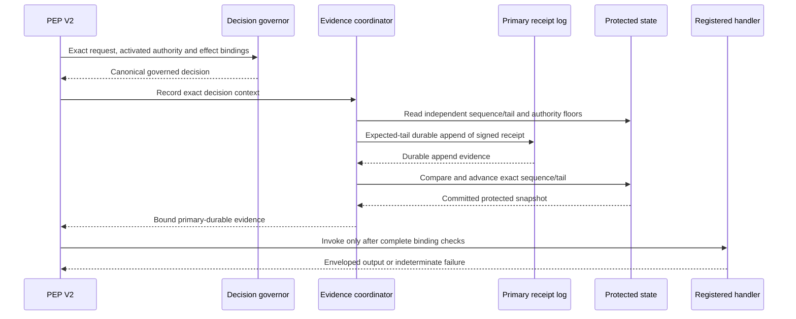

# Decision receipts and governed enforcement

## Development scope

DSE-717 adds a protocol-neutral SDK foundation over the existing content-envelope,
policy, runtime, adapter and executable-bundle contracts. It records a governed
security decision before the registered handler receives an allowed effect. The
historical `guard` proxy keeps its existing behavior; DSE-1076 owns live integration.
This development feature is not included in the published 2.0.0 package.

The intended human checkpoint approves an exact reviewed version and its bounded
actions until either changes. The trust boundary includes an externally governed
signer and independently protected roots, generations and recovery state. A
signature establishes the identity and integrity of signed bytes; it cannot prove
that arbitrary retrieved content, prompts or code are harmless.

The reference providers demonstrate local durability, tamper detection and failure
ordering. They do not establish hardware/platform rollback resistance. Passing a
reference conformance profile never means the complete Agent Trust Kernel has
passed its real restart and snapshot gates.

## Authority and signing

`SignerAuthorizationBundleV1` is activated against an injected TCB root verifier,
trusted time and protected generation/digest floors. A receipt's signer identity
cannot authorize itself. The closed roles and artifact kinds are:

| Role | Artifact kind |
| --- | --- |
| `receipt-signer` | `receipt` |
| `rule-publisher` | `rule` |
| `override-authorizer` | `override` |
| `recovery-administrator` | `recovery` |

`PinnedGovernanceVerifierV1` verifies Ed25519 signatures with public keys only.
An injected `ReceiptSignerV1` supplies signatures; product code provides no private
key loader, generator or signing CLI. Signing and verification commit to the exact
canonical payload, role, artifact kind, signer identity and authorization digest
under the separate `mcp-warden/dse717-signature/v1` domain. Existing artifact-trust
signatures use their own frozen domain and cannot be substituted.

The host must protect root configuration and its generation/digest floors outside
agent-editable inputs. Replacing both a root and its protected commitment replaces
the authority boundary. Runtime permission prompts and text in tool results do
not enroll a signer or grant capabilities.

Signer/root rotation preserves historical signature verification through explicit
TCB-owned pins. `primary_payload_validator()` and `verify_receipt_chain()` accept
`historical_authorities=((old_activated_authorization, old_pinned_verifier), ...)`
alongside the new independently activated authorization/verifier. Retain the old
public keys and sealed root-activated bundles outside the log; a receipt can select
a matching digest but cannot supply or enroll authority. A maximum of 256 total
pins is supported, including the primary pair; duplicate digests fail closed.

Historical scans verify signature, role, artifact kind, exact commitments and
validity at the receipt's signed time. Later live floor advances do not invalidate
historical bytes. The signed time is historical content, not fresh trusted time or
proof of when a retired key was used. The host must govern pin retention/removal;
these APIs do not create an archival key store or prove platform rollback safety.
`verify_signed_receipt()` retains its live-floor checks. Live signing, governance
and coordinator permit/append paths still require the current independently
protected authorization/root floors; retained historical pins cannot admit a
retired signer for a new effect. File-store append alone is evidence persistence,
not a permit; every effect remains behind the coordinator and PEP.

## Receipt events

| Event | Source and restriction |
| --- | --- |
| `allow`, `deny`, `quarantine` | Governed enforcement decision; negatives never invoke a sink |
| `override` | Separately signed, request-bound, finite noncritical authorization |
| `revoke` | Explicit artifact/revocation evidence context; not a revocation command |
| `expiry` | Artifact validity evidence context; not an expiry command |
| `recovery-exit` | Authenticated recovery action bound to the current latch |
| `limit` | Reserved; creation fails closed with `RCT-LIMIT-UNSUPPORTED` |

Canonical unsigned receipts bind the request, base and effective decision,
policy/runtime/rules/revocation state, adapter/bundle/envelope commitments, sequence,
previous entry, store identity, trusted time, recovery state and signer authority.
They contain no raw content, call arguments, internal matched rule IDs, thresholds,
private keys, provider exception text or signature bytes. The separate signed record
contains bounded signature evidence and its receipt digest.

Identical explicit inputs produce identical unsigned bytes. Signature randomness
is outside that determinism claim. A pre-effect receipt records authorization; it
does not prove that the effect completed. Handler failure remains indeterminate and
is never automatically retried.

## Rules and overrides

Rules have bounded, closed fields and operators, one nonempty non-nested `all` or
`any` condition group, unique sorted rule IDs and unique sorted conditions. Supported
operators include exact equality, membership, integer range and taint membership;
regex, glob, imports, expression evaluation, ambient clocks and implicit network
lookups are absent. The activated bundle must match the policy's `rule_set_digest`.

Rules only strengthen decisions. Effective precedence is quarantine, deny, then
unchanged; matched internal rule IDs stay private. Rule activation cannot replace
the mandatory critical floor. An independently authorized override may change only
a registered noncritical deny, with exact request/base-decision/policy/rule/actor/
scope/reason/expiry bindings. It cannot override quarantine or critical reasons.
A rejected override is recorded with `RULE-OVERRIDE-INVALID` when the result is a
deny; quarantine retains its original critical or strengthening-rule reason.
Authority/input errors use closed receipt codes; only state/recovery failures use
`PEP-RECOVERY-ONLY`. Neither rejected overrides nor governor failures downgrade a
base quarantine into deny.

Overrides expire within 3,600 seconds of their explicit issue time. The permitted
override generation/digest is committed to protected state before effect. This is
finite-time authorization, not a one-use token or use-count guarantee; a still-valid
exact authorization may be reconsidered after failure. Post-effect consumption and
outcome evidence are outside this wave.

A revocation generation bump makes a newer snapshot available. It does not by
itself revoke every previously issued lease: explicit lease-digest membership is
what revokes an individual lease, alongside the existing freshness and validity
checks.

## Evidence before effects

V2 records every initial path, including structural blocks and PDP/rule negatives.
Only healthy, correctly bound primary-durable evidence can reach a handler. A
failed allow evidence attempt produces a new deny with
`PEP-EVIDENCE-UNAVAILABLE`, bound to the original decision digest, and exactly one
additional negative evidence attempt. This is not a retry of the original allow.

The primary and fallback logs have independent identities, counters and tails.
Their digests need not match. Every V2 coordinator read requires the nine
mandatory protected floor kinds: adapter, executable-bundle, fallback-log, policy,
receipt-log, revocation, rule, signer-authorization and trust-root. Presence of the
executable-bundle floor is required even when no bundle is used; active bundle
commitment equality is checked when a request references it. Override-floor
presence and generation/digest checks are conditional on explicit override use.
Incomplete protected state blocks primary permits and enters closed latch handling.
Legacy `ProtectedStateSnapshotV1` construction and transitions may still represent
empty floors, but those snapshots are ineligible at this V2 boundary. The legacy
scalar receipt/rule/override floor fields are deprecated compatibility fields:
they are not automatically synchronized with the per-kind `floors` tuple. V2
artifact admission uses the tuple; do not infer an equivalent scalar view or a
proven rollback exploit from their divergence.

Negative primary failure uses the independent
fallback and enters recovery-only mode. Failure of both evidence stores sets the
independent persistent latch; latch failure remains fail closed. Diagnostics expose
registered codes rather than provider paths, exception text or planted secrets.

## Durability, restart and recovery

The POSIX reference file log requires `fcntl` locks and directory `fsync`. It
locks its expected tail, writes complete bounded frames,
flushes the file and directory before every durable append acknowledgment. Startup verifies canonical
records, signatures, chain continuity, sequences and caps. Partial tails, missing
entries, reordered records and primary/protected-state disagreement block normal
operation. Primary and fallback providers cannot alias the same store identity.

Acknowledgments alone do not establish persistence. The coordinator re-reads the
actual append tail before advancing floors, then independently re-reads the exact
protected snapshot and latch after every primary/fallback state transition. Normal
permits and the final pre-sink check reconcile both evidence streams. Inconsistent
or malformed latch values, tails and state acknowledgments keep effects blocked.

The log and protected state do not share a transaction. A crash after append but
before protected advancement leaves a detectable disagreement. A log rolled back
behind an independent protected counter likewise fails closed. Restoring the log
and an ordinary local state file together cannot demonstrate resistance; deployers
must supply and validate a genuinely independent protected platform provider.

Recovery requires an activated administrator action, fresh authority, reconciled
log tails and durable recovery-exit evidence. Protected state advances to the exact
authorized recovery generation and receipt before the latch is cleared. An
identical clear tuple may be retried after a crash; a different tuple is rejected.
Startup accepts recovery exit only when both sides match exactly. A stored
`recovery-exit-authorized` mode alone never permits normal work.

## Verification, replay and safe explanations

Verification checks exact canonical bytes, signatures and signer roles, event
bindings, digest integrity, chains, sequences and explicit protected floors.
Historical replay consumes a complete explicit vector and recomputes the base
decision, governed decision and unsigned receipt. It calls no signer, verifier,
store, PEP or handler, and it cannot authorize current effects. The separate pure
`current_eligibility()` check reports historical authority's compatibility with
an explicitly supplied protected snapshot. It does not refresh trusted time,
activate new authority, authorize execution or replace the live PEP checks.

Human and agent projections have closed key allowlists. `human_projection()` is
explicitly primary-only: it requires a `SignedReceiptV1` and matching
`primary-durable` evidence, and its `fallback_sequence` is always null. Use the
existing closed `serialize_enforcement_result_v2()` for fallback/recovery decision
and evidence status; there is no fallback human-projection API in this wave.
Human evidence exposes
reviewed commitments and coarse decision/evidence/recovery status. Agent output
contains only a receipt reference, effective verdict, coarse reason and registered
next action. Neither exposes content, arguments, matched rule IDs, signatures or
provider exceptions.

## Supported boundaries and outstanding deployment gates

- Use the public activation, coordinator, PEP and serialization APIs. Forged
  Pydantic instances and hostile provider values must fail closed at those boundaries.
- Handler measurement supports CPython 3.11–3.13. Executable code hidden in marshaled
  constants or immutable globals is rejected; ordinary bytes remain supported.
- Reference conformance proves instrumented ordering and failure behavior. Real
  platform restart/rollback conformance remains a separate required profile.
- DSE-1076 must wire the foundation into the actual guard path before the product
  can claim live human-checkpoint enforcement.

`run_receipt_conformance()` requires eleven independently configured scenarios for
every registered operation: allow, deny, primary-log failure, dual-log failure,
protected-state commit failure, a pre-set latch, log rollback and a reopened file
log, plus a malformed latch and false primary/fallback state-commit acknowledgments.
It adds five nonoptional probes for malformed request/runtime/effect,
hostile nested data and effect substitution. Ordering and negative sink absence
are checked against the PEP's own trace; actual signed/fallback artifact bytes,
serialized results and safe projections are scanned for planted secrets.
It invokes positive test handlers, so use isolated test deployments. A passing
report always says `platform_status=unsupported` and `atk_conformant=false`.
The historical scenario key `restarted` denotes file reopen/rescan in the reference
fixture, with the in-process protected state/latch retained. It does not claim a
process, protected-provider or real-platform restart test.

## Resource limits

| Surface | Limit |
| --- | ---: |
| Canonical DSE-717 payload or frame | 256 KiB |
| Reference log file | 64 MiB |
| Counter/generation or trusted-time integer | 0 through 2⁵³ − 1 |
| Rules in a bundle | 256 |
| Conditions in one non-nested group | 64 |
| Membership values in a condition | 128 |
| Independently pinned historical authorities (including primary pair) | 256 |
| Override validity interval | 3,600 seconds |
| Reference vectors / total cases | 64 / 1,024 |
| Planted markers / bytes per marker | 64 / 4,096 |

File payloads are hex-encoded inside a canonical frame, so their effective capacity
is lower than the standalone canonical-payload cap. Over-cap values fail closed;
they are not silently truncated.

The normative requirements remain in [Agent Trust Kernel](AGENT_TRUST_KERNEL.md).
The V1 isolation and adapter contract remain in
[Policy Enforcement](POLICY_ENFORCEMENT.md). Source provenance and the integration
gates are recorded in the [reconciliation plan](plans/2026-10-04-dse717-reconciliation.md).
