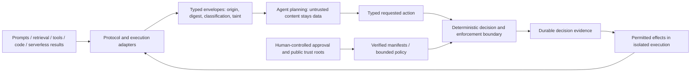

# Tool Integrity Upgrade Implementation Plan

> **For Claude:** REQUIRED SUB-SKILL: Use superpowers:executing-plans to implement this plan task-by-task.

**Goal:** Detect changes to MCP tool annotations and output schemas, keeping human approval bound to the declared surface actually observed.

**Architecture:** Extend the existing capture → canonical hashes → signed lock → drift pipeline at schema level 4. Reuse the structural schema classifier for output schemas and keep Python and TypeScript on one conformance corpus. Existing locks remain readable, but migration requires review and re-attestation; it cannot silently carry approval to newly covered fields.

**Tech Stack:** Python/Pydantic, RFC 8785, SHA-256, MCP SDK 1.x/2.x, zero-dependency TypeScript verifier, pytest, Node test runner.

---

## Brief and scope

Ernest approved DSE-1539's integrity upgrade in the current session. The broader goal is to help agents protect humans and their own execution from malicious external software and content. This release strengthens declared-surface integrity; it does not claim semantic safety, full runtime mediation, or infection-free code/results.

- Hash the complete `annotations` object and `outputSchema`; missing/null hashes canonical JSON null, while `{}` remains distinct.
- Preserve their wire fields through capture. Non-object non-null values are rejected rather than normalized into an empty trusted surface.
- Store annotation/output hashes and the output structural skeleton in every v4 tool entry, including absent-value hashes. Raw annotations/output schema are not added to reports.
- Annotation drift emits `tool-annotations-modified` (high); output changes reuse structural classes with the `schema-out-` prefix, plus added/removed/cosmetic/fallback classes.
- No new permission is derived from hints such as `readOnlyHint` or `destructiveHint`.
- Accept v1–v3 documents with legacy defaults; reject malformed v4 entries missing new hash fields. Keep existing unapproved-change and migration advisory semantics.
- Update TypeScript, shared vectors, committed fixture locks, docs, and meaningful regression tests together.
- Exclude pagination tuning, DSE-1538 capture error handling, HTTP guard, fleet services, signing-key deployment, and ongoing DSE-717 work.

## Task 1: Reproduce and freeze the missing coverage

**Files:** Create `tests/test_tool_integrity.py` and `tests/fixtures/tool_integrity_server.py`; reference `tests/fixtures/_sdk_compat.py`.

1. Build baseline and changed surfaces with identical name/description/input schema but changed annotations or output schema. Assert the overall digest changes and drift is present.
2. Run `.venv/bin/python -m pytest tests/test_tool_integrity.py -q`; expect the new drift tests to fail under v3.
3. Cover absence/null equivalence, absent versus empty object, annotation removal, output-schema removal, structural versus cosmetic changes, redaction, and combined changes.
4. Add a real stdio fixture that reads its declared definition from a test file. Pin/check the same argv before/after changing only the declaration; assert exit 1 and the expected SARIF rules.

## Task 2: Capture and hash the additional fields

**Files:** Modify `src/mcp_warden/{models.py,capture.py,lockfile.py,__init__.py}`.

1. Add `CapturedTool.annotations` and `CapturedTool.output_schema` as nullable object fields; copy wire `annotations`/`outputSchema` from the SDK model.
2. Set schema level to 4. Extend hashed entries with `annotations_hash = hash_value(tool.annotations)`, `output_schema_hash = hash_value(tool.output_schema)`, and `output_schema_skeleton = extract_skeleton(tool.output_schema)` when present, otherwise null.
3. Add optional entry fields for legacy parsing and require v4 hash fields during top-level validation. Preserve legacy serialization without injecting new null fields into old entries.
4. Recompute consistency and surface digests using the document's recorded schema version when inspecting existing locks; fresh builds use version 4.
5. Run focused capture/lock tests. Verify SDK default nulls do not become phantom annotation changes.

## Task 3: Explain changes without granting authority

**Files:** Modify `src/mcp_warden/drift.py` and `src/mcp_warden/guard_list_gate.py`; create `src/mcp_warden/drift_tool_metadata.py` if needed to keep changes readable.

1. Compare annotation hashes only when the baseline has the v4 field; legacy coverage is represented by migration, not an invented historical annotation value.
2. Output hashes likewise compare only when baseline coverage exists. Null-hash transitions classify added/removed; structural skeleton changes reuse `diff_skeletons` and prefix `schema-` with `schema-out-`.
3. Use fixed annotation messages, structural details from the existing redaction path, and no raw annotation values.
4. Migration never weakens unapproved-change. Review old approved lock → new identical surface and old lock → changed surface separately.
5. Run drift/SARIF regression tests; commit the Python implementation after focused tests pass.
6. Extend the existing runtime list gate to the same v4 annotation/output hashes, retaining its legacy-lock and strict/audit/opt-out behavior. Prove a real metadata-only list change is blocked. This extends existing integrity coverage; it adds no new mediation or permission mechanism.

## Task 4: Cross-language contract and independent examples

**Files:** Modify `packages/lock-ts/src/{lock.ts,drift.ts}`, `vectors/tools/generate.py`, `tests/test_spec_vectors.py`, and `packages/lock-ts/test/vectors.test.ts`.

1. Mirror object/null validation, hashing, stored field requirements, output skeletons, and drift rules exactly in TypeScript. Keep its public `verify` refusal as `LockFormatError`.
2. Extend both Python surface adapters to preserve the new fields.
3. Preserve a genuine approved v3 baseline with historical entry digests; do not merely relabel a v4 lock as v3.
4. Add vectors for hint flips/removal, output-schema add/remove/relax/cosmetic/refs, absent/null/empty semantics, malformed v4 fields, and real v3 migration. Retain independent assertions on expected classes so regeneration cannot hide missing detection.
5. Regenerate deliberately with `.venv/bin/python vectors/tools/generate.py`; run `.venv/bin/python -m pytest tests/test_spec_vectors.py -q` and `npm test --prefix packages/lock-ts`. Expect identical digests and ordered findings.

## Task 5: Fixtures, documentation, and release evidence

**Files:** Modify `tests/fixtures/clean.warden.lock`, additional current-version fixture locks if required, `docs/{SPEC.md,WARDEN_LOCK_SCHEMA.md,SIGNING.md}`, `README.md`, `SYSTEM_CONTEXT_DIAGRAM.md`, `DOCUMENTATION_INDEX.md`, and `CHANGELOG.md`.

1. Re-pin the benign committed fixture explicitly at v4; retain historical fixtures used to prove migrations.
2. Document current hashed fields and exclusions (`title`, `icons`, `_meta`), null normalization, new drift classes, and re-attestation requirements. Clarify annotations are untrusted declarations and output schemas do not certify returned content.
3. Document the human-checkpoint proposal below as a proposal linked to existing content-envelope/PDP/PEP/receipt work, not a shipped capability.
4. Run full pytest with CI coverage configuration and the sigstore extra, pinned Ruff, TypeScript conformance, and clean-fixture gate pass/mutated-fixture block.
5. Obtain independent CSO verdict on the exact head; repair any findings, classify the final diff, and prepare the PR. Release must follow the existing security receipt/required-reviewer controls without inventing approval evidence.

## Human–agent checkpoint proposal (not implemented by this upgrade)

Ernest selected: **a reviewed tool version and its allowed actions until it changes**.

SHA-256 fingerprints exact bytes; it does not encrypt them or identify an approver. A digital signature can bind an approved manifest to an explicitly trusted human/DSE signing identity. The private signing capability must remain outside the model and its tool-accessible environment; distributed verifiers receive public trust material, not a shared signing secret. The shipped Sigstore path already verifies lock surface signatures against a pinned identity and issuer, but it does not sign executable code, findings, policy, or tool results.

The next design should bind a manifest to: exact executable/artifact digest and launch identity; tool-surface digest; allowed actions and bounded arguments; policy/rule-bundle digest; approver identity; generation, expiry, and revocation state. Verify these in a deterministic enforcement boundary before effects. Mismatch, missing evidence, expiry, or revocation must deny or quarantine. Tool-returned content remains untrusted data and cannot grant permissions or change trust roots. A signed result can establish provenance and exact bytes, never freedom from malicious intent.

Reuse DSE-715 content envelopes, DSE-716 verified adapters/PDP/PEP, and DSE-717's unfinished signed receipts and protected state. Do not claim their whole-kernel enforcement is live or mutate the existing started ticket. A checkpoint is an authorization boundary, not a claim that a model is conscious or that all harmful behavior can be prevented.

Primary references: [MCP annotations and their limits](https://blog.modelcontextprotocol.io/posts/2026-03-16-tool-annotations/), [Sigstore security model](https://docs.sigstore.dev/about/security/), [Sigstore verification](https://docs.sigstore.dev/cosign/verifying/verify/).

## Growth direction: a protocol-neutral Warden (proposal)

Ernest's intended boundary includes prompts, tool definitions/results, retrieval, executable code, segmented execution, and serverless handlers. Keep the shipped MCP-Warden name and compatibility today. Build toward a small shared deterministic kernel with protocol adapters, rather than embed MCP-specific assumptions in the trust model or launch a new fleet service prematurely.

| Surface | Proposed checkpoint | What that checkpoint does not prove |
|---|---|---|
| Prompts and retrieval | Preserve source/taint; separate trusted instructions from retrieved content; prevent content from modifying authority | Semantic truth or complete prompt-injection detection |
| MCP and other tools | Verify approved surface and implementation digests before registration and use; bound arguments and allowed effects | That an author or tool will behave honestly |
| Generated/local executable code | Treat generated code as untrusted; verify execution identity and enforce filesystem/network/resource boundaries outside the model | That signing makes arbitrary code safe |
| Serverless execution | Verify exact deployed artifact, handler, role, policy, and invocation boundary; mediate effects where they occur | That a function name, URL, or successful TLS connection authenticates deployed code |
| Returned results | Preserve producer/transform provenance and untrusted taint; inspect deterministic hazards before model ingestion or release | That encrypted or signed content is non-malicious |
| Human approval | Bind approved tool version, exact allowed actions/policy, generation, expiry, and revocation; require new approval after material changes | Blanket future permission, permission to modify its own trust roots, or irreversible safety guarantees |

The enforcement boundary must be outside model-editable prompts/state. Segmentation reduces consequences: retrieval workers do not inherit signing authority or unrestricted execution/network privileges; effectful workers receive only bounded capabilities. An agent may request approval or explain a denial, but cannot mint approvals, disable required checks, or strip taint merely by summarizing content. Runtime measurements must be bound to the exact artifact actually executed; checking a file and later executing a substituted one is not sufficient.

Sequence: this v4 declared-surface upgrade → qualify the existing content-envelope and adapter/PDP/PEP foundations → complete signed receipts, anti-replay/rollback, revocation, and recovery evidence → qualify one non-MCP adapter → consider fleet control only after local enforcement is proved. Existing started DSE-717 and dependent DSE-1076 remain separately owned work. This plan does not implement those stages or claim that the shipped guard completely mediates every input or effect.

## Adversarial pass and rollback

- A malicious server can lie consistently: signatures and hashes catch unauthorized changes, not truthfulness. Keep behavioral inspection and bounded effects separate.
- A shared symmetric signing secret in agents would let a compromised agent impersonate the human approver. Distribute verification material only.
- Absent fields must not become `{}` or SDK-default hints; raw annotations must not leak into reports.
- Old locks cannot silently inherit v4 approval. Use genuine v3 bytes and keep migration as a blocking review boundary for approved locks.
- Output skeleton tampering must not excuse approved digest mismatch; malformed v4 field omission must be refused in both readers.
- Keep future-schema rejection and canonical depth bounds intact.
- Roll back package/code through the existing release path; retain old approved locks/signatures as historical evidence. A v3 verifier must reject v4 locks rather than pretend to verify them. No automatic downgrade or re-approval.
